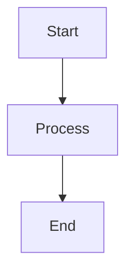
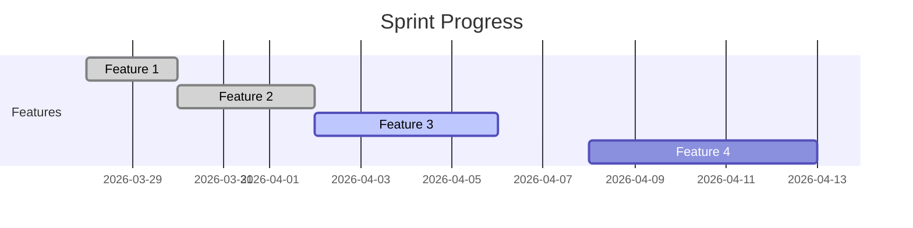

# 📋 Templates de Documentación para Notion

Templates reutilizables para documentación técnica en Notion.

---

## 🎯 Template de Documento Técnico

### Frontmatter para Markdown

```yaml
---
title: "Título del Documento"
description: "Breve descripción del propósito del documento"
category: "modules" # getting-started, architecture, modules, integration, devops, design, testing, user-guide, marketing
module: "crm" # Módulo específico (opcional)
status: "draft" # draft, in_review, published, deprecated, archived
priority: "medium" # low, medium, high, critical
author: "Nombre del Autor"
lastUpdated: "2026-03-28"
notionId: "" # Se completa después de sync
tags: ["technical", "api", "database"]
---
```

### Estructura del Documento

````markdown
# [Título del Documento]

**Categoría:** [Categoría]  
**Módulo:** [Módulo]  
**Estado:** [Estado]  
**Última Actualización:** [Fecha]  
**Autor:** [Nombre]

---

## 📋 Resumen

[1-2 párrafos describiendo el propósito y alcance del documento]

---

## 🎯 Objetivos

- [Objetivo 1]
- [Objetivo 2]
- [Objetivo 3]

---

## 🔧 Detalles Técnicos

### [Subtítulo 1]

[Contenido detallado]

### [Subtítulo 2]

[Contenido detallado]

### Diagramas y Ejemplos


````

```typescript
// Ejemplo de código
const example = () => {
  return "Hello World";
};
```

---

## 📁 Estructura de Archivos

```
ruta/
├── archivo1.ts
├── archivo2.ts
└── archivo3.ts
```

---

## 🔗 Referencias

- [Link a documentación externa](https://example.com)
- [Link a otro documento relacionado](./otro-documento.md)
- [Link a código fuente](../src/path/to/file.ts)

---

## 🚀 Pasos de Implementación

1. [Paso 1]
2. [Paso 2]
3. [Paso 3]

---

## 🧪 Testing

### Checklist de Validación

- [ ] [Criterio de validación 1]
- [ ] [Criterio de validación 2]
- [ ] [Criterio de validación 3]

### Comandos de Testing

```bash
npm test -- [test-specific]
```

---

## 🚨 Solución de Problemas

| Problema     | Causa     | Solución     |
| ------------ | --------- | ------------ |
| [Problema 1] | [Causa 1] | [Solución 1] |
| [Problema 2] | [Causa 2] | [Solución 2] |

---

## 📈 Métricas

| Métrica     | Valor   | Objetivo   |
| ----------- | ------- | ---------- |
| [Métrica 1] | [Valor] | [Objetivo] |
| [Métrica 2] | [Valor] | [Objetivo] |

---

## 📝 Historial de Cambios

| Fecha      | Versión | Cambios                 | Autor    |
| ---------- | ------- | ----------------------- | -------- |
| 2026-03-28 | 1.0     | Creación inicial        | [Nombre] |
| 2026-03-29 | 1.1     | Actualización sección X | [Nombre] |

---

````

---

## 📊 Template de Reporte de Estado

### Frontmatter

```yaml
---
title: "Reporte de Estado - [Módulo/Sprint/Fecha]"
type: "status-report"
category: "modules"
module: "crm"        # Módulo reportado
sprint: "Sprint 1"   # Sprint (si aplica)
period: "2026-03-28 to 2026-04-04"
status: "published"
author: "Nombre del Autor"
notionId: ""
tags: ["report", "status", "sprint"]
---

````

### Estructura del Reporte

````markdown
# Reporte de Estado - [Módulo/Sprint/Fecha]

**Período:** [Fecha inicio] - [Fecha fin]  
**Autor:** [Nombre]  
**Estado:** [Estado del reporte]

---

## 📊 Resumen Ejecutivo

[1-2 párrafos con el resumen del estado]

### Key Metrics

| Métrica         | Valor    | Tendencia | Notas                     |
| --------------- | -------- | --------- | ------------------------- |
| Completado      | 75%      | 📈        | +15% desde último reporte |
| Tiempo Promedio | 2.5 días | 📉        | -0.5 días                 |
| Bloqueadores    | 3        | ➡️        | Sin cambio                |
| Bugs Abiertos   | 12       | 📈        | +2 desde último reporte   |

---

## ✅ Completado

### Features Completadas

| Feature     | Estado | Completado | Notas                     |
| ----------- | ------ | ---------- | ------------------------- |
| [Feature 1] | ✅     | 100%       | Implementación completada |
| [Feature 2] | ✅     | 100%       | Testing finalizado        |
| [Feature 3] | ✅     | 100%       | Documentación actualizada |

### Tareas Completadas

- [ ] [Tarea 1] - [Asignee] - [Comentarios]
- [ ] [Tarea 2] - [Asignee] - [Comentarios]

---

## 🔄 En Progreso

### Features en Desarrollo

| Feature     | Progreso | Estimación | Riesgo | Bloqueadores   |
| ----------- | -------- | ---------- | ------ | -------------- |
| [Feature 4] | 75%      | 2 días     | Bajo   | Ninguno        |
| [Feature 5] | 50%      | 5 días     | Medio  | [Bloqueador 1] |

### Tareas Activas

| Tarea     | Asignee   | Estado      | Tiempo Restante |
| --------- | --------- | ----------- | --------------- |
| [Tarea 3] | [Persona] | In Progress | 1 día           |
| [Tarea 4] | [Persona] | Review      | 0.5 días        |

---

## ⚠️ Bloqueadores y Riesgos

### Bloqueadores Críticos

1. **Bloqueador 1**
   - **Descripción:** [Descripción detallada]
   - **Impacto:** [Alto/Medio/Bajo]
   - **Acciones:** [Acciones para resolver]
   - **Responsable:** [Nombre]
   - **Fecha Esperada:** [Fecha]

2. **Bloqueador 2**
   - [Misma estructura]

### Riesgos Identificados

| Riesgo     | Probabilidad | Impacto | Mitigación           |
| ---------- | ------------ | ------- | -------------------- |
| [Riesgo 1] | Alta         | Alto    | [Plan de mitigación] |
| [Riesgo 2] | Media        | Medio   | [Plan de mitigación] |

---

## 📅 Próximos Pasos

### Próxima Semana (Prioridad)

1. [Acción prioritaria 1]
2. [Acción prioritaria 2]
3. [Acción prioritaria 3]

### Pendientes de Largo Plazo

- [ ] [Tarea pendiente 1]
- [ ] [Tarea pendiente 2]
- [ ] [Tarea pendiente 3]

---

## 📈 Métricas de Progreso

### Velocidad del Equipo


````

### Burndown Chart (Ejemplo)

```
Día 1: 40 puntos
Día 2: 35 puntos (-5)
Día 3: 30 puntos (-5)
Día 4: 25 puntos (-5)
Día 5: 20 puntos (-5)
Objetivo: 20 puntos
```

---

## 🎯 Metas para Próximo Período

### Objetivos SMART

1. **Específico:** [Objetivo específico]
   - **Medible:** [Cómo medir]
   - **Alcanzable:** [Por qué es alcanzable]
   - **Relevante:** [Relevancia para el proyecto]
   - **Temporal:** [Fecha límite]

2. **Específico:** [Otro objetivo]

---

## 📝 Decisiones y Aprendizajes

### Decisiones Tomadas

| Decisión     | Contexto   | Alternativas   | Razón   |
| ------------ | ---------- | -------------- | ------- |
| [Decisión 1] | [Contexto] | [Alternativas] | [Razón] |
| [Decisión 2] | [Contexto] | [Alternativas] | [Razón] |

### Lecciones Aprendidas

- **Qué funcionó bien:** [Lista]
- **Qué mejorar:** [Lista]
- **Recomendaciones:** [Lista]

---

## 🔗 Recursos y Referencias

- [Documentación relacionada](./documento-relacionado.md)
- [Plan original](../plans/original-plan.md)
- [Métricas detalladas](../metrics/detailed-metrics.md)

---

## 📞 Contacto y Soporte

**Responsable:** [Nombre]  
**Email:** [email]  
**Slack/Teams:** [canal]

**Siguiente Reporte:** [Fecha del próximo reporte]

---

````

---

## 🐛 Template de Reporte de Bug

### Frontmatter

```yaml
---
title: "Bug Report: [Descripción breve]"
type: "bug-report"
category: "testing"
module: "crm"              # Módulo afectado
severity: "high"           # critical, high, medium, low
priority: "P1"             # P0, P1, P2, P3
status: "open"             # open, in_progress, resolved, closed, wontfix
reporter: "Nombre"
assignee: "Nombre"
created: "2026-03-28"
notionId: ""
tags: ["bug", "reproducible", "regression"]
---

````

### Estructura del Bug Report

````markdown
# Bug Report: [Descripción breve]

**ID:** BUG-[Número]  
**Severidad:** [Critical/High/Medium/Low]  
**Prioridad:** [P0/P1/P2/P3]  
**Módulo:** [Módulo afectado]  
**Reportado por:** [Nombre]  
**Fecha:** [Fecha]  
**Estado:** [Estado actual]

---

## 📋 Resumen

[Descripción clara y concisa del problema]

---

## 🎯 Impacto

### Usuarios Afectados

- [ ] Todos los usuarios
- [ ] Usuarios específicos: [Descripción]
- [ ] Solo en producción
- [ ] Solo en desarrollo

### Funcionalidad Afectada

- [ ] Core feature
- [ ] Secondary feature
- [ ] UI/UX
- [ ] Performance
- [ ] Security
- [ ] Other: [Especificar]

### Severidad Justificación

[Explicación de por qué la severidad asignada]

---

## 🔍 Pasos para Reproducir

1. [Paso 1]
2. [Paso 2]
3. [Paso 3]
4. [Paso 4]
5. [Paso 5]

**Resultado Esperado:** [Qué debería pasar]  
**Resultado Actual:** [Qué pasa actualmente]

---

## 📸 Evidencia

### Screenshots/Videos

[Descripción o link a screenshots]

### Logs y Errores

```bash
# Logs relevantes
[Timestamp] ERROR: Error message
[Timestamp] WARN: Warning message
```
````

### Console Output

```javascript
// Output de consola
Uncaught TypeError: Cannot read property 'x' of undefined
    at Function.name (file.js:123:45)
```

---

## 🧪 Environment

| Componente            | Versión/Detalles                     |
| --------------------- | ------------------------------------ |
| **Sistema Operativo** | Windows 11 / macOS 14 / Ubuntu 22.04 |
| **Navegador**         | Chrome 122 / Firefox 115 / Safari 17 |
| **App Versión**       | 1.2.3                                |
| **API Versión**       | v2.1                                 |
| **Base de Datos**     | PostgreSQL 17                        |
| **Dispositivo**       | Desktop / Mobile / Tablet            |
| **Red**               | WiFi / Ethernet / Mobile Data        |

### Configuración Específica

- [ ] Usuario autenticado
- [ ] Permisos específicos: [Lista]
- [ ] Configuración especial: [Detalles]
- [ ] Datos específicos: [Descripción]

---

## 🔄 Comportamiento Esperado vs Actual

### Escenarios de Uso

| Escenario     | Esperado                  | Actual                  |
| ------------- | ------------------------- | ----------------------- |
| [Escenario 1] | [Comportamiento esperado] | [Comportamiento actual] |
| [Escenario 2] | [Comportamiento esperado] | [Comportamiento actual] |

### Frecuencia

- [ ] Siempre (100% reproducible)
- [ ] Frecuente (>50% de los intentos)
- [ ] Ocasional (<50% de los intentos)
- [ ] Raro (solo ocurrió una vez)

---

## 🔗 Relaciones

### Issues Relacionados

- [ ] Bug relacionado: BUG-[número]
- [ ] Feature request: FR-[número]
- [ ] Task: TASK-[número]

### Áreas de Código Afectadas

- `src/path/to/file.ts` - Líneas 123-145
- `src/another/file.js` - Líneas 45-67

### Dependencias

- [ ] Frontend
- [ ] Backend API
- [ ] Base de Datos
- [ ] Servicios externos

---

## 💡 Posible Solución

### Hipótesis de Causa Raíz

[Explicación de la posible causa del problema]

### Soluciones Propuestas

1. **Solución A** (Recomendada)
   - **Descripción:** [Descripción detallada]
   - **Pros:** [Ventajas]
   - **Cons:** [Desventajas]
   - **Esfuerzo:** [Estimación]

2. **Solución B** (Alternativa)
   - [Misma estructura]

### Workarounds Temporales

[Si existe un workaround, describirlo aquí]

---

## 📊 Tracking

### Timeline

| Fecha      | Evento      | Detalles            |
| ---------- | ----------- | ------------------- |
| 2026-03-28 | Reportado   | Reporte inicial     |
| 2026-03-28 | Triaged     | Asignado a [Nombre] |
| 2026-03-29 | In Progress | Comenzado debugging |
| 2026-03-30 | Resuelto    | Fix implementado    |

### Métricas

| Métrica                 | Valor           |
| ----------------------- | --------------- |
| Tiempo hasta triage     | 2 horas         |
| Tiempo hasta asignación | 4 horas         |
| Tiempo hasta resolución | 2 días          |
| Tiempo total            | 2 días, 6 horas |

---

## ✅ Verificación

### Criterios de Aceptación

- [ ] Bug reproducible según los pasos
- [ ] Fix resuelve el problema completamente
- [ ] No introduce regresiones
- [ ] Tests actualizados/pasando
- [ ] Documentación actualizada

### Testing Post-Fix

| Test Case     | Resultado | Comentarios   |
| ------------- | --------- | ------------- |
| [Test case 1] | ✅ Pasó   | [Comentarios] |
| [Test case 2] | ✅ Pasó   | [Comentarios] |
| [Test case 3] | ✅ Pasó   | [Comentarios] |

---

## 📝 Notas Adicionales

[Espacio para notas, investigaciones, conversaciones relevantes]

---

## 🔄 Historial de Cambios

| Fecha      | Versión | Cambios                             | Autor    |
| ---------- | ------- | ----------------------------------- | -------- |
| 2026-03-28 | 1.0     | Reporte inicial                     | [Nombre] |
| 2026-03-29 | 1.1     | Agregado información de environment | [Nombre] |
| 2026-03-30 | 1.2     | Agregado posible solución           | [Nombre] |

---

## 📞 Contacto

**Reportado por:** [Nombre] - [Email/Slack]  
**Asignado a:** [Nombre] - [Email/Slack]  
**QA Contact:** [Nombre] - [Email/Slack]

**SLA Recordatorio:** [Recordatorio de SLA si aplica]

---

````

---

## 🏗️ Template de Decisión de Arquitectura

### Frontmatter

```yaml
---
title: "ADR-[número]: [Título de la decisión]"
type: "architecture-decision"
category: "architecture"
status: "proposed"    # proposed, accepted, rejected, superseded, deprecated
decisionDate: "2026-03-28"
reviewDate: "2026-04-04"
author: "Nombre"
notionId: ""
tags: ["architecture", "decision", "database", "api"]
---

````

### Estructura del ADR

```markdown
# ADR-[número]: [Título de la decisión]

**Estado:** [Proposed/Accepted/Rejected/Superseded]  
**Fecha de Decisión:** [Fecha]  
**Fecha de Revisión:** [Fecha] (si aplica)  
**Autor:** [Nombre]  
**Participantes:** [Lista de participantes]

---

## 📋 Contexto y Problema

[Descripción del problema o oportunidad que requiere una decisión]

**Factores a considerar:**

- [Factor 1]
- [Factor 2]
- [Factor 3]

**Restricciones:**

- [Restricción 1]
- [Restricción 2]

**Suposiciones:**

- [Suposición 1]
- [Suposición 2]

---

## 🎯 Objetivos de la Decisión

### Objetivos Principales

- [Objetivo 1]
- [Objetivo 2]
- [Objetivo 3]

### Métricas de Éxito

| Métrica     | Valor Objetivo | Método de Medición |
| ----------- | -------------- | ------------------ |
| [Métrica 1] | [Valor]        | [Método]           |
| [Métrica 2] | [Valor]        | [Método]           |

---

## 🔄 Opciones Consideradas

### Opción 1: [Nombre de la opción]

**Descripción:** [Descripción detallada]

**Pros:**

- [Ventaja 1]
- [Ventaja 2]
- [Ventaja 3]

**Cons:**

- [Desventaja 1]
- [Desventaja 2]
- [Desventaja 3]

**Riesgos:**

- [Riesgo 1] - [Mitigación]
- [Riesgo 2] - [Mitigación]

**Costo/Esfuerzo:** [Estimación]

### Opción 2: [Nombre de la opción]

[Misma estructura]

### Opción 3: [Nombre de la opción]

[Misma estructura]

---

## 📊 Análisis Comparativo

| Criterio           | Opción 1     | Opción 2     | Opción 3     |
| ------------------ | ------------ | ------------ | ------------ |
| **Performance**    | [Puntuación] | [Puntuación] | [Puntuación] |
| **Escalabilidad**  | [Puntuación] | [Puntuación] | [Puntuación] |
| **Mantenibilidad** | [Puntuación] | [Puntuación] | [Puntuación] |
| **Costo**          | [Puntuación] | [Puntuación] | [Puntuación] |
| **Time to Market** | [Puntuación] | [Puntuación] | [Puntuación] |
| **Riesgo**         | [Puntuación] | [Puntuación] | [Puntuación] |
| **Total**          | [Total]      | [Total]      | [Total]      |

---

## 🎯 Decisión

### Decisión Seleccionada

**Opción [número]: [Nombre de la opción]**

### Justificación

[Explicación detallada de por qué se seleccionó esta opción]

**Factores decisivos:**

- [Factor 1]
- [Factor 2]

**Compromisos aceptados:**

- [Compromiso 1]
- [Compromiso 2]

---

## 🔧 Implicaciones

### Implicaciones Técnicas

- [Implicación 1]
- [Implicación 2]
- [Implicación 3]

### Implicaciones de Negocio

- [Implicación 1]
- [Implicación 2]

### Implicaciones de Equipo

- [Implicación 1]
- [Implicación 2]

---

## 🚀 Plan de Implementación

### Fases

1. **Fase 1: Preparación** (Fecha inicio - Fecha fin)
   - [Tarea 1]
   - [Tarea 2]

2. **Fase 2: Implementación** (Fecha inicio - Fecha fin)
   - [Tarea 1]
   - [Tarea 2]

3. **Fase 3: Transición** (Fecha inicio - Fecha fin)
   - [Tarea 1]
   - [Tarea 2]

### Recursos Requeridos

| Recurso     | Cantidad   | Duración   |
| ----------- | ---------- | ---------- |
| [Recurso 1] | [Cantidad] | [Duración] |
| [Recurso 2] | [Cantidad] | [Duración] |

---

## 🧪 Validación

### Criterios de Validación

- [ ] [Criterio 1]
- [ ] [Criterio 2]
- [ ] [Criterio 3]

### Métricas de Validación

| Métrica     | Línea Base | Objetivo | Actual  |
| ----------- | ---------- | -------- | ------- |
| [Métrica 1] | [Valor]    | [Valor]  | [Valor] |
| [Métrica 2] | [Valor]    | [Valor]  | [Valor] |

---

## 📈 Seguimiento y Revisión

### Métricas de Seguimiento

| Métrica     | Frecuencia | Responsable |
| ----------- | ---------- | ----------- |
| [Métrica 1] | Semanal    | [Nombre]    |
| [Métrica 2] | Mensual    | [Nombre]    |

### Fecha de Revisión

[Fecha programada para revisar la decisión]

**Condiciones para re-evaluación:**

- [Condición 1]
- [Condición 2]

---

## 🔗 Relaciones

### ADRs Relacionados

- ADR-[número]: [Título]
- ADR-[número]: [Título]

### Documentación Relacionada

- [Documento 1](./documento1.md)
- [Documento 2](./documento2.md)

### Dependencias

- [Dependencia 1]
- [Dependencia 2]

---

## 📝 Historial de Revisión

| Fecha      | Versión | Cambios                 | Participantes |
| ---------- | ------- | ----------------------- | ------------- |
| 2026-03-28 | 1.0     | Creación inicial        | [Nombres]     |
| 2026-03-29 | 1.1     | Revisión equipo técnico | [Nombres]     |
| 2026-03-30 | 2.0     | Aceptada formalmente    | [Nombres]     |

---

## 📞 Contacto

**Owner:** [Nombre] - [Contacto]  
**Stakeholders:** [Lista de stakeholders]  
**Revisores:** [Lista de revisores]

**Próxima Revisión:** [Fecha]

---
```

---

## 🚀 Scripts para Importar Templates

### Convertir Template a Notion Page

```javascript
// scripts/import-template-to-notion.js
const { Client } = require("@notionhq/client");
const fs = require("fs");

const notion = new Client({ auth: process.env.NOTION_API_KEY });

async function importTemplate(templatePath, databaseId) {
  const template = fs.readFileSync(templatePath, "utf8");
  const { frontmatter, content } = parseTemplate(template);

  const page = await notion.pages.create({
    parent: { database_id: databaseId },
    properties: buildProperties(frontmatter),
    children: convertMarkdownToBlocks(content),
  });

  console.log(`Template imported: ${page.id}`);
  return page;
}

// Uso
importTemplate("templates/technical-doc.md", process.env.NOTION_DATABASE_DOCS);
```

### Generar Templates desde CLI

```bash
# Generar nuevo documento técnico
node scripts/generate-doc.js \
  --title "Nuevo Documento" \
  --category "modules" \
  --module "crm" \
  --output docs/03-modules/crm/nuevo-documento.md

# Generar ADR
node scripts/generate-adr.js \
  --number 001 \
  --title "Decisión sobre Base de Datos" \
  --output docs/02-architecture/adr-001.md
```

---

## 📁 Estructura de Templates

```
templates/
├── technical-doc.md          # Documento técnico general
├── status-report.md          # Reporte de estado
├── bug-report.md            # Reporte de bug
├── architecture-decision.md  # ADR template
├── meeting-notes.md         # Notas de reunión
├── user-story.md           # Historia de usuario
└── README.md              # Instrucciones
```

---

## 🔄 Workflow con Templates

1. **Seleccionar Template**

   ```bash
   node scripts/list-templates.js
   ```

2. **Generar Documento**

   ```bash
   node scripts/generate-from-template.js --template bug-report
   ```

3. **Completar Información**
   - Abrir documento generado
   - Completar secciones relevantes
   - Agregar detalles específicos

4. **Importar a Notion**

   ```bash
   node scripts/sync-to-notion.js --file nuevo-documento.md
   ```

5. **Tracking**
   - Notion actualiza estado automáticamente
   - GitHub sync mantiene versión en repo
   - Reportes generados desde Notion

---

**Última actualización:** 2026-03-28  
**Estado:** ✅ Templates listos para uso
