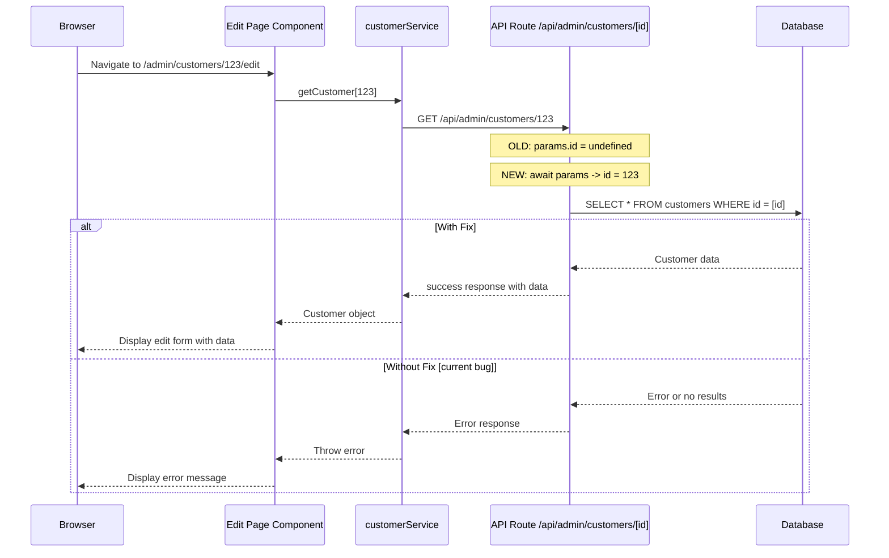

# Fix Plan: Customer Edit Page Error

## Problem Summary

When accessing `/admin/customers/[id]/edit`, the page throws an error:

```
Error: An unknown error occurred
    at unwrapData (client-helpers.ts:142:9)
    at Object.getCustomer (customerService.ts:257:22)
```

## Root Cause Analysis

### The Issue

The API route at [`src/app/api/admin/customers/[id]/route.ts`](src/app/api/admin/customers/[id]/route.ts:17) uses the **old Next.js params pattern**:

```typescript
// CURRENT (BROKEN) CODE
export async function GET(
  request: NextRequest,
  { params }: { params: { id: string } },  // params typed as synchronous object
) {
  // ...
  logger.info("Customer Detail API GET called", { customerId: params.id });  // Direct access
```

### Why It Fails

In **Next.js 14.2+**, the `params` object in dynamic routes is now a **Promise** that must be awaited. This change was introduced to support asynchronous route parameter resolution.

When `params.id` is accessed without awaiting, it returns `undefined` or an unexpected value, causing:

1. The database query to fail (searching for customer with `id = undefined`)
2. The API to return an error response
3. The client-side [`unwrapData()`](src/lib/api/client-helpers.ts:135) function to throw "An unknown error occurred"

### Evidence

Other routes in the project have already been updated to use the correct pattern:

```typescript
// CORRECT PATTERN (used in other routes)
export async function GET(
  request: NextRequest,
  { params }: { params: Promise<{ id: string }> }, // params typed as Promise
) {
  const { id } = await params; // Await and destructure
  // Now use `id` normally
}
```

Examples from the codebase:

- [`src/app/api/admin/orders/[id]/route.ts`](src/app/api/admin/orders/[id]/route.ts:235): `const { id } = await params;`
- [`src/app/api/admin/products/[id]/route.ts`](src/app/api/admin/products/[id]/route.ts:18): `const { id } = await params;`
- [`src/app/api/admin/quotes/[id]/route.ts`](src/app/api/admin/quotes/[id]/route.ts:35): `const { id } = await params;`

## Solution

### Changes Required

Update [`src/app/api/admin/customers/[id]/route.ts`](src/app/api/admin/customers/[id]/route.ts) to properly await params in all three HTTP methods:

#### 1. GET Handler (Line 15-342)

**Before:**

```typescript
export async function GET(
  request: NextRequest,
  { params }: { params: { id: string } },
) {
  try {
    logger.info("Customer Detail API GET called", { customerId: params.id });
    // ... uses params.id throughout
```

**After:**

```typescript
export async function GET(
  request: NextRequest,
  { params }: { params: Promise<{ id: string }> },
) {
  try {
    const { id } = await params;
    logger.info("Customer Detail API GET called", { customerId: id });
    // ... replace all `params.id` with `id`
```

#### 2. PUT Handler (Line 344-496)

Same pattern change required.

#### 3. DELETE Handler (Line 498-602)

Same pattern change required.

### Detailed Fix Steps

1. **Update the params type annotation** in all three handlers from:

   ```typescript
   { params }: { params: { id: string } }
   ```

   to:

   ```typescript
   { params }: { params: Promise<{ id: string }> }
   ```

2. **Add await and destructure** at the beginning of each handler:

   ```typescript
   const { id } = await params;
   ```

3. **Replace all occurrences** of `params.id` with `id` throughout the file

### Files to Modify

| File                                        | Changes                                          |
| ------------------------------------------- | ------------------------------------------------ |
| `src/app/api/admin/customers/[id]/route.ts` | Update GET, PUT, DELETE handlers to await params |

## Verification

After applying the fix:

1. Navigate to `/admin/customers/[id]/edit` with a valid customer ID
2. Verify the customer data loads correctly
3. Verify the edit form is populated with customer data
4. Test updating a customer to ensure PUT also works
5. Test deleting a customer to ensure DELETE also works

## Related Issues

This same issue may exist in other routes that haven't been updated. A broader audit should be performed to find and fix any remaining routes using the old pattern.

## Flow Diagram


