# Plan de Corrección de Bugs - Productos

## Resumen Ejecutivo

Se han identificado 3 bugs en la sección de productos que necesitan corrección:

1. **Dropdown de Categoría General no carga en formulario "Agregar Producto"**
2. **Input de búsqueda causa recarga de página en tab Productos**
3. **Estilo incorrecto del botón "Agregar Producto"**

---

## Issue 1: Dropdown de Categoría General no carga

### Ubicación

- [`src/app/admin/products/add/page.tsx`](src/app/admin/products/add/page.tsx:644-663) - Formulario con el bug
- [`src/app/admin/products/edit/[id]/page.tsx`](src/app/admin/products/edit/[id]/page.tsx:752-771) - Formulario que funciona correctamente

### Análisis del Problema

**En el formulario Add Product (líneas 275-291):**

```typescript
const fetchCategories = async () => {
  // ...
  const response = await fetch(`/api/categories?${params.toString()}`);
  const data = await response.json();
  if (response.ok) {
    setCategories(extractDataFromResponse<Category>(data)); // ← PROBLEMA AQUÍ
  }
};
```

**En el formulario Edit Product (líneas 350-354, 481):**

```typescript
const categoriesResponse = await fetch("/api/categories");
const categoriesData = await categoriesResponse.json();
// ...
setCategories(categoriesData.categories || []); // ← Acceso directo
```

### Causa Raíz

El helper [`extractDataFromResponse<T>()`](src/lib/api/response-helpers.ts:26-61) no incluye "categories" en su lista de claves de datos:

```typescript
// src/lib/api/response-helpers.ts líneas 38-52
const dataKeys = [
  "customers",
  "products",
  "orders",
  "quotes",
  "workOrders",
  "work_orders",
  "appointments",
  "users",
  "tickets",
  "messages",
  "adminUsers",
  "branches",
  "inventory",
  // "categories" ← FALTA ESTA CLAVE
];
```

Cuando la API devuelve `{ categories: [...] }`, el helper no encuentra la clave y devuelve un array vacío.

### Solución

**Archivo:** [`src/lib/api/response-helpers.ts`](src/lib/api/response-helpers.ts:38)

Agregar "categories" al array `dataKeys`:

```typescript
const dataKeys = [
  "customers",
  "products",
  "orders",
  "quotes",
  "workOrders",
  "work_orders",
  "appointments",
  "users",
  "tickets",
  "messages",
  "adminUsers",
  "branches",
  "inventory",
  "categories", // ← AGREGAR ESTA LÍNEA
];
```

---

## Issue 2: Input de búsqueda causa recarga de página

### Ubicación

- [`src/app/admin/products/sections/ProductListingSection.tsx`](src/app/admin/products/sections/ProductListingSection.tsx) - Con el bug
- [`src/components/admin/lenses/LensFamiliesList.tsx`](src/components/admin/lenses/LensFamiliesList.tsx) - Referencia correcta

### Análisis del Problema

**ProductListingSection (con bug):**

- Usa React Query con búsqueda del lado del servidor
- Cada cambio en `searchTerm` dispara una nueva petición API
- Muestra estado de carga mientras busca (líneas 347-358)
- El debounce (líneas 137-158) no evita el loading state

**LensFamiliesList (correcto):**

- Carga todos los datos una vez
- Filtrado del lado del cliente (líneas 120-128)
- Sin estado de carga durante la búsqueda
- Actualización instantánea de la tabla

### Causa Raíz

El componente `ProductListingSection` implementa búsqueda del lado del servidor:

```typescript
// Líneas 91-107
const { products, total, isLoading, ... } = useProducts({
  page: currentPage,
  itemsPerPage,
  categoryFilter: filters.categoryFilter,
  statusFilter: filters.statusFilter,
  searchTerm: debouncedSearchTerm, // ← Se envía al servidor
  // ...
});

// Líneas 347-358 - Muestra loading durante la búsqueda
if ((productsLoading || isSearching) && products.length === 0) {
  return <LoadingState />;
}
```

### Solución

Implementar filtrado del lado del cliente similar a `LensFamiliesList`:

1. **Modificar `useProducts` hook** para no enviar `searchTerm` al servidor
2. **Agregar filtrado client-side** en `ProductListingSection`
3. **Remover estado `isSearching`** y el loading state asociado

**Cambios en ProductListingSection.tsx:**

```typescript
// 1. Remover debouncedSearchTerm y isSearching state
// 2. Modificar useProducts para no usar searchTerm
const { products, total, isLoading, ... } = useProducts({
  page: currentPage,
  itemsPerPage,
  categoryFilter: filters.categoryFilter,
  statusFilter: filters.statusFilter,
  // searchTerm: debouncedSearchTerm, ← REMOVER
  showLowStockOnly: filters.showLowStockOnly,
  currentBranchId,
  isGlobalView,
  isSuperAdmin,
});

// 3. Agregar filtrado client-side
const filteredProducts = products.filter((product) => {
  if (!filters.searchTerm) return true;
  const searchLower = filters.searchTerm.toLowerCase();
  return (
    product.name.toLowerCase().includes(searchLower) ||
    (product.sku || "").toLowerCase().includes(searchLower) ||
    (product.brand || "").toLowerCase().includes(searchLower)
  );
});
```

---

## Issue 3: Estilo incorrecto del botón "Agregar Producto"

### Ubicación

- [`src/app/admin/products/index.tsx`](src/app/admin/products/index.tsx:40-46) - Botón con estilo incorrecto
- [`src/app/admin/products/sections/CategoriesManagementSection.tsx`](src/app/admin/products/sections/CategoriesManagementSection.tsx:131-134) - Referencia correcta

### Análisis del Problema

**Botón "Agregar Producto" (incorrecto):**

```typescript
<Button
  onClick={() => router.push("/admin/products/add")}
  className="bg-azul-profundo hover:bg-azul-profundo/90 text-white"
>
  <Plus className="h-4 w-4 mr-2" />
  Agregar Producto
</Button>
```

**Botón "Nueva Categoría" (correcto):**

```typescript
<Button onClick={openCreateCategoryDialog}>
  <Plus className="h-4 w-4 mr-2" />
  Nueva Categoría
</Button>
```

### Causa Raíz

El botón "Agregar Producto" usa clases CSS personalizadas (`bg-azul-profundo`) que pueden no estar definidas o no coincidir con el tema. El botón "Nueva Categoría" usa el estilo default del componente Button que aplica correctamente el color primary del tema.

### Solución

Remover el className personalizado y dejar que el botón use el estilo default:

```typescript
<Button
  onClick={() => router.push("/admin/products/add")}
  // Remover className personalizado
>
  <Plus className="h-4 w-4 mr-2" />
  Agregar Producto
</Button>
```

---

## Diagrama de Arquitectura

```mermaid
flowchart TB
    subgraph Issue1[Issue 1: Category Dropdown]
        A1[Add Product Page] --> B1[fetchCategories]
        B1 --> C1[extractDataFromResponse]
        C1 --> D1{categories key?}
        D1 -- NO --> E1[Returns empty array]
        D1 -- YES --> F1[Returns categories]

        G1[Fix: Add categories to dataKeys] --> D1
    end

    subgraph Issue2[Issue 2: Search Reload]
        A2[ProductListingSection] --> B2[useProducts Hook]
        B2 --> C2[Server-side Search]
        C2 --> D2[Loading State Shown]

        E2[LensFamiliesList] --> F2[Client-side Filter]
        F2 --> G2[Instant Update]

        H2[Fix: Client-side filtering] --> A2
    end

    subgraph Issue3[Issue 3: Button Style]
        A3[Agregar Producto Button] --> B3[Custom className]
        B3 --> C3[Incorrect Color]

        D3[Nueva Categoría Button] --> E3[Default Style]
        E3 --> F3[Correct Primary Color]

        G3[Fix: Remove custom className] --> A3
    end
```



---

## Archivos a Modificar

| Archivo                                                     | Cambio                                    | Issue |
| ----------------------------------------------------------- | ----------------------------------------- | ----- |
| `src/lib/api/response-helpers.ts`                           | Agregar "categories" a dataKeys           | #1    |
| `src/app/admin/products/sections/ProductListingSection.tsx` | Implementar filtrado client-side          | #2    |
| `src/app/admin/products/index.tsx`                          | Remover className personalizado del botón | #3    |

---

## Orden de Implementación

1. **Issue 1** - Más simple, solo agregar una línea
2. **Issue 3** - Simple, remover una propiedad
3. **Issue 2** - Más complejo, requiere refactor del hook y componente

---

## Notas Adicionales

- El Issue 2 puede requerir considerar la paginación: si hay muchos productos, el filtrado client-side podría no funcionar correctamente. Evaluar si se necesita mantener búsqueda server-side con un enfoque diferente (ej: no mostrar loading state).
- Verificar que los tests existentes pasen después de los cambios.
- El color primary del tema está definido en [`src/app/globals.css`](src/app/globals.css:51) como `--primary: #AE0000` (Brand Red).
