# Flujos Duales de Onboarding (Etapa 1 Marketing)

Documentación de los dos flujos de onboarding diferenciados para la etapa 1 de marketing.

---

## Resumen de flujos

| Flujo                 | Origen          | Signup                | Demo                                 | Banner/Botón Activar | Activación              |
| --------------------- | --------------- | --------------------- | ------------------------------------ | -------------------- | ----------------------- |
| **Ópticas conocidas** | Link exclusivo  | Via `/acceso-opticas` | Propia 7 días (Mirada Clara clonada) | Visible              | Auto (dentro de 7 días) |
| **Orgánicos**         | Landing pública | Bloqueado             | Via aprobación root                  | Oculto               | Solo vía soporte        |

---

## Diagrama de flujos

```mermaid
flowchart TB
    subgraph known [Flujo Ópticas Conocidas]
        A1[Link /acceso-opticas] --> A2[Signup]
        A2 --> A3[Verificar email]
        A3 --> A4[Login]
        A4 --> A5[Onboarding Choice]
        A5 --> A6[Crear demo dedicada 7d]
        A6 --> A7[Admin con banner y botón]
        A7 --> A8[Activar óptica en 7 días]
    end

    subgraph organic [Flujo Orgánicos]
        B1[Landing] --> B2[Solicitar Demo]
        B2 --> B3[Formulario /solicitar-demo]
        B3 --> B4[Root aprueba]
        B4 --> B5[Crear usuario + demo dedicada]
        B5 --> B6[Email con acceso]
        B6 --> B7[Login]
        B7 --> B8[Admin sin banner]
        B8 --> B9[Activación vía soporte]
    end
```

---

## Configuración

### Variables de entorno

| Variable                  | Descripción                                                                                                                              |
| ------------------------- | ---------------------------------------------------------------------------------------------------------------------------------------- |
| `DEMO_OPTICAS_ACCESS_KEY` | (Opcional) Si está definida, `/acceso-opticas` requiere `?key=<valor>` para acceder. Sin ella, el link es público para quien lo conozca. |
| `CRON_SECRET`             | Requerido para el cron de limpieza de demos expiradas.                                                                                   |

### system_config (global)

| Clave                   | Tipo    | Default | Descripción                                                                              |
| ----------------------- | ------- | ------- | ---------------------------------------------------------------------------------------- |
| `signup_enabled`        | boolean | `false` | Si `true`, el signup público en `/signup` está habilitado. En etapa 1 suele ser `false`. |
| `onboarding_stage_mode` | boolean | `true`  | Indica que estamos en etapa 1 (flujos duales).                                           |

---

## Cómo compartir el link de ópticas conocidas

1. **Sin key**: Compartir `https://tu-dominio.com/acceso-opticas`. Cualquiera con el link puede registrarse.
2. **Con key**: Configurar `DEMO_OPTICAS_ACCESS_KEY` en Vercel/env y compartir `https://tu-dominio.com/acceso-opticas?key=<valor>`. Solo quienes tengan el key podrán acceder.

El link está disponible en el dashboard **Flujos de Nuevos Usuarios** (`/admin/saas-management/new-users-flow`) con botón para copiar.

---

## Cómo aprobar solicitudes desde el dashboard

1. Ir a **SaaS Management** → **Flujos de Nuevos Usuarios**.
2. Revisar la tabla de solicitudes pendientes (orgánicos desde `/solicitar-demo`).
3. Clic en **Aprobar** para una solicitud:
   - Si el email no tiene cuenta: se crea usuario vía invite, se crea demo dedicada (`demo_type: organic`), se envía email con acceso.
   - Si el email ya tiene cuenta: se asigna la demo dedicada creada a ese usuario.
4. Las demos orgánicas **no muestran** el banner "Activar tu Óptica" ni permiten auto-activación; la conversión se gestiona vía soporte.

---

## Cómo desactivar la etapa 1 (reactivar flujo normal)

1. En `system_config` (scope global), actualizar:
   - `signup_enabled` = `true` para habilitar signup público.
   - `onboarding_stage_mode` = `false` si se desea indicar fin de etapa 1.
2. Los CTAs de la landing seguirán apuntando a `/solicitar-demo` o `/signup` según la lógica actual; si `signup_enabled` es `true`, el signup no redirigirá a solicitar-demo.

---

## Archivos principales

| Tipo      | Ruta                                                                        |
| --------- | --------------------------------------------------------------------------- |
| Migración | `supabase/migrations/20260305000000_add_onboarding_stage_config.sql`        |
| Migración | `supabase/migrations/20260305000001_create_demo_requests.sql`               |
| Migración | `supabase/migrations/20260305000002_create_demo_org_for_user.sql`           |
| Migración | `supabase/migrations/20260305000004_cleanup_expired_demo_organizations.sql` |
| API       | `src/app/api/landing/onboarding-config/route.ts`                            |
| API       | `src/app/api/demo-requests/route.ts`                                        |
| API       | `src/app/api/cron/cleanup-expired-demos/route.ts`                           |
| Página    | `src/app/solicitar-demo/page.tsx`                                           |
| Página    | `src/app/acceso-opticas/page.tsx`                                           |
| Página    | `src/app/admin/saas-management/new-users-flow/page.tsx`                     |

---

## Limpieza de demos expiradas

El cron `GET /api/cron/cleanup-expired-demos` se ejecuta diariamente (5:00 UTC). Llama a la función SQL `cleanup_expired_demo_organizations()` que:

- Busca orgs con `metadata->>'is_demo' = 'true'` y `expires_at < NOW()`.
- Excluye la demo global (`00000000-0000-0000-0000-000000000001`).
- Borra en orden respetando FKs y retorna la lista de orgs eliminadas.

Requiere `CRON_SECRET` en el header `Authorization: Bearer <CRON_SECRET>` o `x-cron-secret: <CRON_SECRET>`.
