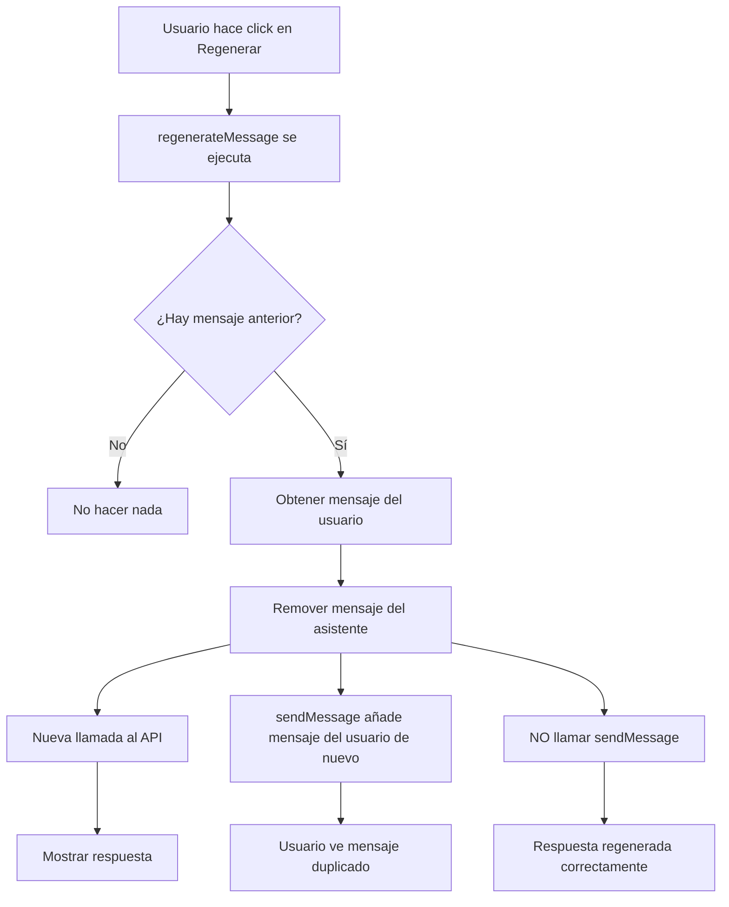

# Plan de Corrección de Bugs - Opttius App

## Resumen de Bugs Identificados

### 1. Bug: Citas no aparecen en agenda después de guardarse + Error useEffect

**Archivo afectado:** [`src/components/admin/AppointmentCalendar.tsx`](src/components/admin/AppointmentCalendar.tsx:86)

**Causa raíz:**
- Falta importar `useEffect` en el import de React (línea 3)
- El componente usa `useEffect` en la línea 86 pero solo importa `useState` y `useMemo`

**Error en consola:**
```
ReferenceError: useEffect is not defined
    at AppointmentCalendar (AppointmentCalendar.tsx:86:3)
```

**Solución propuesta:**
```typescript
// Línea 3: Cambiar de:
import { useState, useMemo } from "react";

// A:
import { useState, useMemo, useEffect } from "react";
```

---

### 2. Bug: Regeneración de mensaje duplica el mensaje del usuario

**Archivo afectado:** [`src/components/admin/ChatbotContent/hooks/useChatMessages.ts`](src/components/admin/ChatbotContent/hooks/useChatMessages.ts:308)

**Causa raíz:**
En la función `regenerateMessage` (líneas 308-323):
1. Se remueve el mensaje del asistente con `setMessages((prev) => prev.slice(0, messageIndex))`
2. Luego `sendMessage(userMessage.content)` vuelve a añadir el mensaje del usuario
3. Esto causa duplicación del mensaje del usuario

**Código problemático:**
```typescript
const regenerateMessage = useCallback(async (messageId: string) => {
  const messageIndex = messages.findIndex((m) => m.id === messageId);
  if (messageIndex <= 0) return;
  
  const userMessage = messages[messageIndex - 1];
  if (userMessage.role !== "user") return;
  
  // Remueve el mensaje del asistente
  setMessages((prev) => prev.slice(0, messageIndex));
  
  // Pero sendMessage añade el mensaje del usuario de nuevo!
  await sendMessage(userMessage.content);
}, [messages, sendMessage]);
```

**Solución propuesta:**
Modificar `regenerateMessage` para que no llame a `sendMessage` directamente, sino que reutilice el contenido del mensaje del usuario para regenerar la respuesta del asistente:

```typescript
const regenerateMessage = useCallback(async (messageId: string) => {
  const messageIndex = messages.findIndex((m) => m.id === messageId);
  if (messageIndex <= 0) return;
  
  const userMessage = messages[messageIndex - 1];
  if (userMessage.role !== "user") return;
  
  // Remueve el mensaje del asistente y todos los subsiguientes
  setMessages((prev) => prev.slice(0, messageIndex));
  
  // En lugar de llamar sendMessage,模拟 una nueva llamada al API
  // con el contenido del mensaje del usuario existente
  await simulateAssistantResponse(userMessage.content);
}, [messages, sendMessage, currentSession, config, ...]);
```

O alternativamente, modificar `sendMessage` para aceptar un parámetro opcional que indique si debe añadir el mensaje del usuario:

```typescript
const sendMessage = useCallback(async (content: string, addUserMessage: boolean = true) => {
  if (!content.trim() || isStreaming) return;

  const userMessage: Message = {
    id: crypto.randomUUID(),
    role: "user",
    content,
    timestamp: new Date().toISOString(),
  };

  // Solo añadir el mensaje del usuario si addUserMessage es true
  if (addUserMessage) {
    setMessages((prev) => [...prev, userMessage]);
  }
  // ... resto del código
}, [isStreaming, currentSession, config, ...]);

// En regenerateMessage:
await sendMessage(userMessage.content, false);
```

---

### 3. Bug: Buscador de productos recarga la página

**Archivos afectados:**
- [`src/app/admin/products/sections/ProductListingSection.tsx`](src/app/admin/products/sections/ProductListingSection.tsx)
- [`src/app/admin/products/components/ProductFilters.tsx`](src/app/admin/products/components/ProductFilters.tsx)

**Causa raíz:**
El usuario reporta que cada vez que se escribe un carácter en el buscador, la página se recarga completamente. El Input en ProductFilters.tsx no tiene protección contra submit de form.

**Solución propuesta:**
Agregar `type="search"` al Input y `onKeyDown` para prevenir comportamientos nativos:

```typescript
// En ProductFilters.tsx, modificar el Input:
<Input
  type="search"  // Agregar type="search"
  placeholder="Buscar productos por nombre..."
  value={searchTerm}
  onChange={(e) => onSearchChange(e.target.value)}
  onKeyDown={(e) => {
    // Prevenir que Enter cause submit
    if (e.key === 'Enter') {
      e.preventDefault();
    }
  }}
  className="pl-10"
/>
```

También verificar que el debounce está funcionando correctamente.

---

### 4. Feature Request: Unificar familia de lentes de contacto

**Estado actual:**
- Ya existe `/admin/lens-families` con tabs unificadas (Optical/Contact)
- Ya existe `/admin/lens-management` con tabs para Families/Matrices
- Pero las rutas individuales de contact-lens-families y contact-lens-matrices existen por separado

**Rutas existentes:**
```
src/app/admin/lens-families/          ← YA UNIFICADO
src/app/admin/lens-management/        ← YA TIENE LOGICA
src/app/admin/contact-lens-families/   ← SEPARADO
src/app/admin/contact-lens-matrices/   ← SEPARADO
src/app/admin/lens-matrices/          ← OPTICOS
```

**Solución propuesta:**
Las rutas ya están disponibles y funcionando. El issue menciona que se deben verificar que funcionan correctamente. No es necesario crear nuevas páginas, sino verificar y posiblemente mejorar la integración.

Verificar:
1. Que `/admin/lens-families` muestra correctamente ambas tabs (Optical/Contact)
2. Que `/admin/lens-management` permite navegar entre familias y matrices de ambos tipos
3. Que las páginas individuales funcionan correctamente

---

## Plan de Implementación

### Fase 1: Bugs Críticos (Impacto Alto)

#### Tarea 1.1: Corregir useEffect faltante
- **Archivo:** `src/components/admin/AppointmentCalendar.tsx`
- **Línea:** 3
- **Cambio:** Agregar `useEffect` al import
- **Tiempo estimado:** 5 minutos
- **Riesgo:** Bajo - cambio simple de una línea

#### Tarea 1.2: Corregir duplicación de mensajes en Chat
- **Archivo:** `src/components/admin/ChatbotContent/hooks/useChatMessages.ts`
- **Líneas:** 308-323 (función `regenerateMessage`)
- **Cambio:** Modificar para no duplicar el mensaje del usuario
- **Tiempo estimado:** 30 minutos
- **Riesgo:** Medio - requiere modificar lógica de estado

### Fase 2: Bugs de UX (Impacto Medio)

#### Tarea 2.1: Corregir recarga de página en buscador
- **Archivo:** `src/app/admin/products/components/ProductFilters.tsx`
- **Líneas:** 57-62
- **Cambio:** Agregar type="search" y preventDefault en Enter
- **Tiempo estimado:** 10 minutos
- **Riesgo:** Bajo - cambio simple

### Fase 3: Mejoras de Integración (Impacto Bajo)

#### Tarea 3.1: Verificar funcionamiento de rutas de contact-lens
- Verificar `/admin/contact-lens-families`
- Verificar `/admin/contact-lens-matrices`
- Verificar integración con `/admin/lens-families`
- Verificar integración con `/admin/lens-management`
- **Tiempo estimado:** 30 minutos
- **Riesgo:** Bajo - solo verificación

---

## Diagrama de Flujo - Regeneración de Mensajes



---

## Checklist de Verificación

- [ ] AppointmentCalendar no muestra error de useEffect
- [ ] Citas se guardan y aparecen en la agenda
- [ ] Regeneración de chat no duplica mensajes del usuario
- [ ] Buscador de productos filtra sin recargar la página
- [ ] Tab de Lentes de Contacto funciona en /admin/lens-families
- [ ] Navegación entre familias/matrices de contacto funciona

---

## Notas Adicionales

### Sobre las Citas (Appointments)
El error de `setState in render` indica que hay una llamada a `setState` durante el render del componente. Esto podría estar relacionado con el bug del `useEffect` faltante. Una vez corregido el import de `useEffect`, este error debería resolverse.

### Sobre la estructura de archivos
El proyecto ya tiene una buena organización con:
- `lens-families/page.tsx` unificado
- `lens-management/page.tsx` con navegación
- `contact-lens-families/page.tsx` y `contact-lens-matrices/page.tsx` separados pero funcionales

No es necesario refactorizar la estructura, solo verificar que todo funciona correctamente.

---

## Próximos Pasos

1. **Inmediato:** Corregir los 3 bugs críticos (useEffect, chat, buscador)
2. **Corto plazo:** Verificar funcionamiento de todas las rutas de contact-lens
3. **Mediano plazo:** Documentar las correcciones realizadas
4. **Largo plazo:** Considerar refactorización si hay más problemas recurrentes
